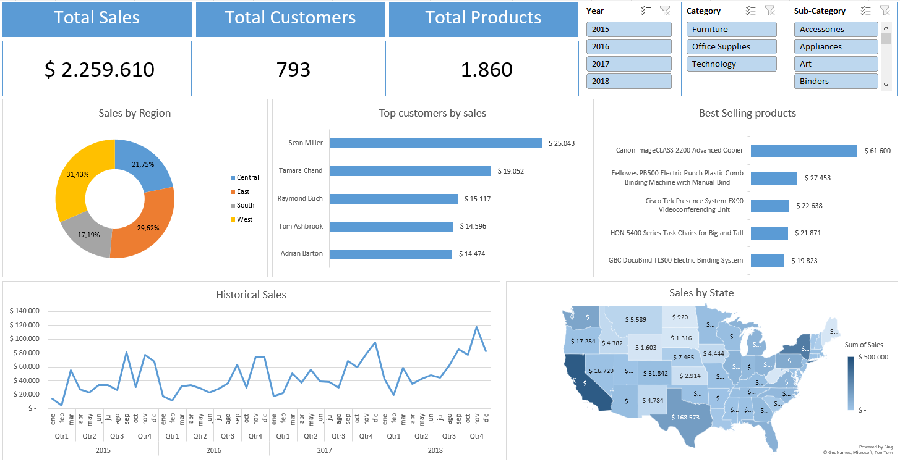

# 📊 Sales Dashboard – README

## 🧭 Introduction

This dashboard provides an interactive overview of sales performance across multiple dimensions, including time, geography, customers, and products. It is designed to support business analysis and decision-making by highlighting key performance indicators (KPIs), sales trends, and top contributors to revenue.

The dashboard consolidates historical sales data into a single, easy-to-use interface that allows users to quickly identify patterns, compare performance across regions and states, and understand which customers and products drive the highest sales.

---

## 🖼️ Dashboard Overview

*Interactive sales dashboard showing KPIs, regional performance, top customers and products, and historical sales trends.*

---

## 🛠️ Tools Used

- **Microsoft Excel**
  - PivotTables and PivotCharts
  - Slicers for interactive filtering
  - Map chart for geographic analysis
- **Excel Dashboard Design Techniques**
  - KPI cards
  - Chart alignment and layout standardization
  - Sheet protection to preserve layout integrity

---

## ▶️ How to Use the Dashboard

1. Use the slicers located on the top-right side to filter the data by:
   - **Year** (2015–2018)
   - **Category** (Furniture, Office Supplies, Technology)
   - **Sub-Category** (e.g., Accessories, Appliances, Art, Binders)

2. All KPIs and charts update automatically based on the selected filters.

3. Use the dashboard to:
   - Monitor total sales, customers, and products
   - Analyze sales distribution by region and state
   - Identify top-performing customers and products
   - Explore sales trends over time

The dashboard sheet is protected to allow interaction through slicers while preventing accidental changes to charts or layout.

---

## 📈 Dashboard Analysis

### Key Performance Indicators (KPIs)
- **Total Sales**: Displays total revenue for the selected filters.
- **Total Customers**: Number of unique customers contributing to sales.
- **Total Products**: Number of distinct products sold.
- With the exception of 2016, sales, customer count, and product volume showed sustained year-over-year growth. In 2018, total sales reached $721,351, with 690 customers and 1,517 products. Compared to 2017, these figures represent increases of 20%, 9%, and 12%, respectively, and compared to 2015, increases of 50%, 17%, and 25%.

### Sales by Region
- Sales are distributed across four regions: Central, East, South, and West.
- The West and East regions contribute the largest share of total sales (more than 60%), indicating strong regional performance.

### Top Customers by Sales
- This chart highlights the top 5 customers by total sales.
- A small group of five customers accounts for a significant portion of revenue (5% of total sales).
- Considering a total of 792 customers between 2015 and 2018, this concentration highlights opportunities for key account management, retention strategies, and targeted marketing efforts focused on high-impact clients.

### Best-Selling Products
- Shows the **top 5 products by sales**.
- High-value office and technology products dominate the ranking, indicating which product lines drive the most revenue.

### Historical Sales
- Displays sales trends over time from 2015 to 2018.
- Overall sales exhibit an upward trend with clear seasonal fluctuations. Sales are typically lower in the first quarter and increase steadily toward the fourth quarter of each year. With the exception of 2016, sales have grown year over year, indicating sustained long-term growth.

### Sales by State
- Illustrates the geographic distribution of sales across U.S. states.
- The states California, New York, Texas, Washington and Pennsylvania contribute 52% to total sales, highlighting key markets and potential areas for expansion.

---

## 🧾 Conclusions

- The dashboard reveals strong and sustained business growth, with consistent increases in sales, customer base, and product volume over time, except for a temporary slowdown in 2016.
- Sales performance shows a clear seasonal pattern, with lower activity in the first quarter and peak sales toward the end of the year, providing valuable input for demand forecasting and inventory planning.
- Revenue is geographically concentrated, with the West and East regions—and particularly five key states—accounting for a significant share of total sales. These areas represent core markets that could be prioritized for strategic investment and expansion.
- A relatively small number of customers generate a disproportionate share of total revenue, highlighting the importance of key account management and customer retention strategies to protect and grow high-value relationships.
- Sales are driven primarily by high-value office and technology products, indicating that these product categories are central to overall revenue performance and should remain a focus for pricing, promotion, and product development decisions.
- Overall, the dashboard provides a comprehensive and actionable view of sales performance, enabling data-driven decision-making across growth strategy, customer management, regional focus, and product optimization.
- Overall, the dashboard provides a clear, interactive, and business-oriented view of sales performance, suitable for both operational monitoring and high-level analysis.

---

## 👤 Author

**Nahuel Moreno Yalet**  
Data Scientist | Data Analyst

